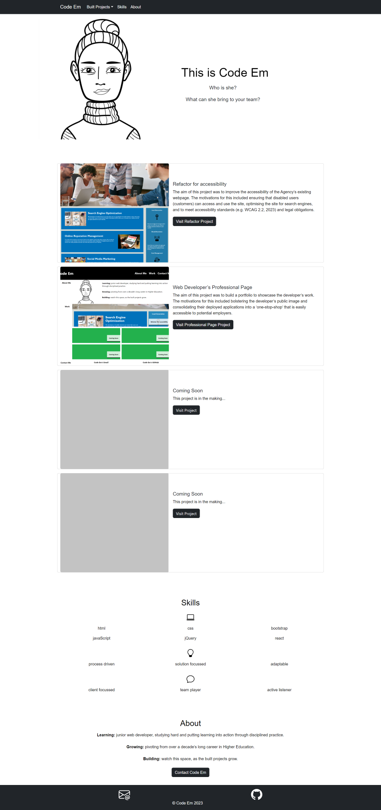

# Web Developer’s Professional Page (Bootstrap)

## Description

This project is an iteration of the [Web Developer’s Professional Page (2023)](https://code0em.github.io/webdev-professional-page/). The aim of this project was to build a portfolio to showcase the developer’s work. The motivations for this included bolstering the developer’s public image and consolidating their deployed applications into a ‘one-stop-shop’ that is easily accessible to potential employers.

In this iteration of the project, however, the brief specified that the page should make use of Bootstrap.

The project criteria also included creating a page that displays the developer’s name and avatar in a jumbotron and sections to portfolio their recent work, their skills and details about them (including their contact details). The former two criteria (jumbotron and skills section) were additional criteria for this iteration of the project.

The specification for the footer section (also specific to this iteration of the project) was to include a hover effect on all hyperlinks in the footer, which display a box shadow upon hover.

As with the original project brief, the page was required to be responsive on various screens and devices.

## Build

To meet the aims of the project, Bootstrap layouts (e.g. containers, grids), components (e.g. navbar, cards, buttons) and more were utilised.

While the pages relies on Bootstrap’s styling for the most part, a custom CSS was also built to override some of this styling (e.g. font-family, color etc).

The page also relies on Bootstrap for its ‘built-in’ responsiveness, however two custom media queries were added for stylistic preferences at resolutions equal to or greater than 768px (i.e. Boostrap’s medium breakpoint).

## Installation

N/A

## Usage

Users navigate to the webpage via the URL ([Code Em - Web Developer](ADD LINK WHEN DEPLOYED)). When on the webpage, users can navigate to different sections of the page via the hyperlinks in the navigation bar.

Call to action (CTA) buttons within the jumbotron, built projects and about sections also prompt users to immediate action. For example, to visit the projects showcased on the page, users can select the CTA button labeled “Visit [project name]” and will be navigated to said project’s external page.

Note: Whilst some projects remain ‘in the making’ (i.e. are not yet available to visit), a Bootstrap modal has been used to display a ‘coming soon’ message when the user selects these associated CTA buttons.

The webpage on a resolution of 1400px (or higher) will display as follows:

Note: On resolutions of 1399px or below, aspects of the pages will display differently. For example, on resolutions equal to or less than 768px, the project images will appear in full (i.e. not cropped according to ratio) and will be positioned above the project header, text and CTA button.

